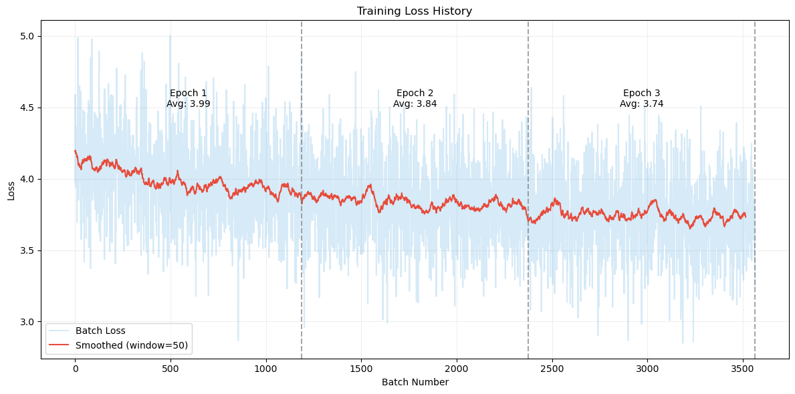

# Отчет о выполнении задания

## Описание проекта

Проект представляет собой 2 чат бота и сравнение их выводов между собой.
1. GPT2
2. LLAMA


## Данные

**Источник**: Транскрипции сериала "Доктор Хаус" с Kaggle.
**Объем**: 8 сезонов, ~10 000 реплик.
**Предобработка**:
  - Очистка текста от лишних символов и тегов.
  - Создание пар "контекст-ответ".


## Модели

### GPT2

Pre-trained модель дообучается (fine-tuning) на специфичных данных
Masked training: Обучение только на части последовательности после разделителя (sep_token)
Causal Attention: Механизм самомаскировки для предотвращения "подсматривания" в будущие токены


### Llama-3

Адаптация под диалоговый формат через чат-шаблоны
Используется гибридный подход: QLoRA + PEFT (Parameter-Efficient Fine-Tuning)
Оптимизация памяти через 4-битное квантование и пейджинг


## Веб-приложение

Основано на модели GPT2, работает в асинхронном режиме.

**Технологии**: FastAPI, HTML, JavaScript.

### Функционал

  - Отправка сообщений по нажатию **Enter** или кнопки **Send**.
  - Отображение истории сообщений.


Для установки зависимостей:

```bash
pip install -r requirements.txt
```

### Запуск

```bash
python src/app.py
```

### Развертывание в Docker

```bash
docker-compose up --build
```


## Графики
В результате тестирования, получилось такое распределение



## Выводы
- Бот успешно имитирует стиль доктора Хауса.
- Веб-приложение и Telegram-бот работают стабильно.
- Docker-контейнеры позволяют развернуть приложения на любом сервере.


## Автор

Косачев Дмитрий Викторович


### **Итоговая структура проекта**
```
house-md-chatbot/
├── processed/
│ ├── raw/
│ │ ├── context_answer.csv
│ │ └── context_answer.json
│ └── data/
│   ├── season1.csv
│   ├── ...
│   └── season8.csv
├── images/
│ └── GPT2.png
├── models/
│ ├── Gpt-model
│ │ └── ...
│ ├── Gpt-tokenizer
│ │ └── ...
│ └── Llamaa-merged
│   └── ...
├── notebooks/
│ ├── Data preprocessing.ipynb
│ ├── GPT2 training.ipynb
│ ├── LLAMA training.ipynb
│ └── Model Compare.ipynb
├── src/
│ └── app.py
├── static/
│ └── script.js
│ └── style.css
├── templates/
│ └── index.html
├── .env
├── .gitignore
├── docker-compose.yml
├── Dockerfile
├── README.md
└── requirements_bot.txt
```